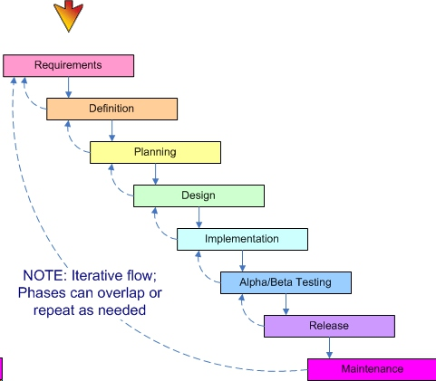
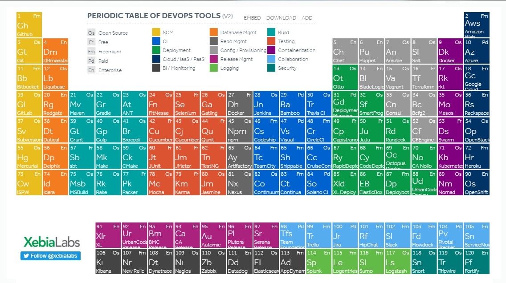

## 0 微服务架构
### 0.1 微服务的定义
- - - - -
#### 0.1.1 单体应用及其痛点理解
传统的开发模式都是基于单体应用的开发模式，虽然在设计阶段发展了MVC之类的设计思想，在逻辑上有着明确的分层，但是在应用的开发，测试，部署上都有着很强的耦合，相互依赖

单体应用面临的问题:
- 维护的成本增加: 随着代码量的增加，代码之间的耦合越来越严重(更多情况是为了改bug而引入的一些代码)，代码的可读性越来越差，而且随着后期可能测试覆盖不到的点越来越多，整个系统的维护不断呈现一种恶性循环的状态
- 交付周期长: 单体应用的实现过程，在各个开发，测试，构建，部署的各个阶段都存在着比较大的耦合，任何一个点的问题，都可能会导致整个系统的崩溃(AAA的开发中表现很频繁，如一个业务的权限点文件的错误，最后导致表现的现象可能是整个系统都没有办法使用；或者是CI构建一个完全不了解的模块编译错误，导致需要整个工程重新编译，而往往一次编译就可能需要一个小时)，没有一个很好的机制可以做到并行
- 可伸缩性差: 单体应用虽然**易于伸缩**，这种模式是基于clone的 方式，去做水平伸缩，而不是按照业务的需求去实现
- 人员能力培养: 单体应用对人员能力要求是比较高，由于整个应用的各方面可能都需要了解，才能将系统跑起来
- - - - --
#### 0.1.2 微服务框架定义
下面是`Martin Fowler`对[微服务架构](https://martinfowler.com/articles/microservices.html)的一个定义:
>   The microservice architectural style is an approach to developing a single application as a suite of** small services**, each running in its **own process** and communicating with **lightweight mechanisms**, often an HTTP resource API. These services are built around **business capabilities** and **independently deployable** by fully **automated deployment machinery**. There is** a bare minimum of centralized management** of these services, which may be written in different programming languages and use different data storage technologies. 
- - - - -
> 微服务架构是一种架构模式，它提倡将单一应用程序划分成一组小的服务，服务之间互相协调、互相配合，为用户提供最终价值。
每个服务运行在其独立的进程中，服务与服务间采用轻量级的通信机制互相协作（通常是基于HTTP协议的RESTful API）。
每个服务都围绕着具体业务进行构建，并且能够被独立的部署到生产环境、生产环境等。
另外，应当尽量避免统一的、集中式的服务管理机制，对具体的一个服务而言，应根据业务上下文，选择合适的⾔言、工具对其进行构建。

然后在其blog中提到了微服务架构的基本特征
- Componentization via Services  以服务来实现组件化(而不是以依赖库的方式)
从独立部署的角度去考虑，依赖于库的方式，任何一个底层库的改变，可能都需要你对整个系统去重新部署；
另外通过RPC的方式，能够让组件更加明确对外提供的接口，做到松耦合
- Organized around Business Capabilities  通过业务来组织服务
- Products not Projects  以做产品的思路而不是做项目的思路
 `you build it， you run it !`
- Smart endpoints and dumb pipes 
- Decentralized Governance 服务管理去中心化
- Decentralized Data Management 数据管理去中心化
- Infrastructure Automation 自动化
- Design for failure 面向失效的设计原则
- Evolutionary Design 快速演进的设计原则
- - - - -
### 0.2 微服务产生背景及认识误区
微服务架构并不是新发明的语言或者开发技术，而是过去需求的集合及IT技术演进，基于敏捷，持续交付，DevOps等形成的一种架构风格
- - - - -
#### 0.2.1 微服务产生背景
在介绍微服务产生的背景之前，先梳理几个软件开发演进过程中产生的名词，分别是`敏捷`、`DevOps`、`持续交付流水线`
##### 0.2.1.1 敏捷(Alige)
传统的交付很多是按照瀑布模型的方式进行开发，但是针对瀑布模型这种预定义的方法，其每个阶段都有着强烈的依赖关系，前一阶段的输入被当成是后一阶段的输入，如果前一阶段的输入质量不高或者未能达标，则对后一阶段的影响是巨大的，甚至是造成项目的停滞，导致整个开发周期的延长；根据现有的调查，70%采用瀑布模型开发的软件项目都以失败而告终。

**敏捷(Alige)**这种开发思路就是在这种背景诞生，其**核心**在于从瀑布开发中"fix Scope，elastic time&resource"转变为"fixed time&source, elastic scope"，体现为由计划驱动转变为由价值驱动

但是敏捷关注的点主要是需求到实现这一过程，能够实现快速响应需求，快速实现；而没有办法保证功能的快速测试，快速部署，从而衍生出DevOps，构成一个更大的循环，促进功能能够更快速响应客户需求
- - - - -
##### 02.1.2 DevOps
回顾软件行业的研发模式，可以发现大致有三个阶段：瀑布式开发、敏捷开发、DevOps。下面这张图是红帽子分享，从开发模式，应用架构，部署方式，基础设施等角度，展示了软件工程的变化。

DevOps一词的来自于Development和Operations的组合，突出重视软件开发人员和运维人员的沟通合作，通过自动化流程来使得软件构建、测试、发布更加快捷、频繁和可靠。
**DevOps是为了填补开发端和运维端之间的信息鸿沟，改善团队之间的协作关系**。不过需要澄清的一点是，从开发到运维，中间还有测试环节。DevOps其实包含了三个部分：开发、测试和运维。
换句话说，DevOps希望做到的是软件产品交付过程中**IT工具链的打通**，使得各个团队减少时间损耗，更加高效地协同工作。专家们总结出了下面这个DevOps能力图，良好的闭环可以大大增加整体的产出。

实现DevOps依赖于工具上的准备和组织间的协同，其中工具链方面包含了以下方面:
- 代码管理（SCM）：GitHub、GitLab、BitBucket、SubVersion、TFS
- 构建工具：Ant、Gradle、maven
- 自动部署：Capistrano、CodeDeploy
- 持续集成（CI）：Bamboo、Hudson、Jenkins
- 配置管理：Ansible、Chef、Puppet、SaltStack、ScriptRock GuardRail
- 容器：Docker、LXC、Rkt、第三方厂商如AWS
- 编排：Kubernetes、Apache Mesos、DC/OS
- 服务注册与发现：Zookeeper、etcd、Consul
- 脚本语言：python、ruby、shell
- 日志管理：ELK、Logentries
- 系统监控：Datadog、Graphite、Icinga、Nagios
- 性能监控：AppDynamics、New Relic、Splunk
- 压力测试：JMeter、Blaze Meter、loader.io
- 预警：PagerDuty、pingdom、厂商自带如AWS SNS
- HTTP加速器：Varnish
- 消息总线：ActiveMQ、SQS
- 应用服务器：Tomcat、JBoss
- Web服务器：Apache、Nginx、IIS
- 数据库：MySQL、Oracle、PostgreSQL等关系型数据库；cassandra、mongoDB、redis等NoSQL数据库
- 项目管理（PM）：Jira、Asana、Taiga、Trello、Basecamp、Pivotal Tracker
xebialabs整理了炫酷的[DevOps工具链周期表](https://xebialabs.com/periodic-table-of-devops-tools/#rd)

- - - - -
##### 0.2.1.3 持续集成能力成熟度
如何缩短交付周期，按照持续交付的能力成熟度模型中，包含以下 7点:
1. 持续部署
2. 内建质量
3. 环境管理
4. 数据管理
5. 反馈验证
6. 组织协同
7. 松耦合架构
上述几点，除松耦合架构之外，其他的很多点在之前的开发过程中都有了很大程度的发展，但是如果架构本身不支持，互相之间有着很多的依赖，依然没有办法有效地缩短交付周期。
- - - - -
根据前面提到软件行业的变化， 从下面几个角度来解释微服务架构的产生背景。
首先，互联网行业以及移动互联网是微服务架构诞生的一个孵化器，由于互联网行业天生就有着**快速交付**的压力，根据MVP(Minimum Viable Product)的理论，希望其产品能够不断的快速迭代；大部分微服务使用的标杆性企业都是互联网企业如, AWS, Netflix等；
然后是由于前面提到的单体应用的带来各种痛点；
接着是以容器化等新技术的出现，带来对传统部署模型不断简化，能够有效提升运维效率；
DevOps解决的是开发和运维之间的本身冲突，开发崇尚的是不断更新，拥抱变化，而运维则是希望稳定，使得系统保持稳定运行；其代表的工具链的不断成熟
最后是在以快速交付的思想下和技术能力不断成熟情况下产生的持续交付的概念，对微服务框架有着极大的促进；下面这张图是对前面概念的一个汇总

#### 0.2.2 微服务认识误区
微服务能让开发变得更加简单
微服务架构并不是银弹，微服务面临的挑战
- 分布式系统的复杂度
    1. 时延/性能问题
    2. 事务一致性问题 
    3. 服务治理 (服务的动态部署，autoscaling)
    4. 前后台通信
- 运维成本
    1. 环境配置
    2. 部署/监控/告警
    3. 问题定位
- 测试
    1. 合理的测试策略
- 团队协作
#### 0.2.3 微服务的本质
> 微服务是一组**独立交付**的由**特定业务单元**构成的**分布式**系统

不要仅仅局限于将技术层面，更重要的是根据业务，按照合理的组织协作实现功能交付。
微服务有着一下优点:
- 独立性: 独立部署，灵活按需伸缩
- 技术实现多样性:  不受技术框架限制，多种技术栈
- 组织优化: 康威定律，逆康威定律
- 边界性: 有着明确的边界，松耦合高内聚
- - - - -
#### 0.2.4 微服务框架一般构成
单一微服务内部构成

微服务生态系统的整体架构图如下:

- - - - -
### 0.3 微服务设计原则
和Maritin Fowler提出的微服务框架特点一致，在未付开发过程中主要关注以下4个原则
- 围绕业务 
    1. 构建服务
            解决什么是微服务，如何划分服务粒度的疑问；微服务的拆分需要贴合具体的业务和团队自动化能力；基于DDD(领域驱动设计)或者面向对象的设计方法
    2. 构建团队
- 去中心化
    1. 解决技术栈的限制
    2. 服务管理
    3. 数据管理 : 业务与数据分离，各个微服务可以有自己独立的数据库；各业务自己通过接口访问其他业务数据
- 自动化
    持续交付流水线
    1. 自动化基础设施
    2. 自动化测试
    3. 自动化部署
- 演进式架构
支持增量式变更作为第一原则；尽量降低变更的成本，使得架构的演进更加容易

- - - - -
### 0.4 接口设计原则
- - - - -
### 0.5 遗留问题
**问题:** 精益创业的思路 (精益思想，MVP)
**问题:** 持续交付能力成熟度模型
**问题:** CAP原则
**问题:** 事务一致性: ebay最终一致性 -> 事务消息和数据消息 每个事务有自己的消息，通过event table记录消息，通过定时任务去执行同步event table，**两阶段提交** 同构数据库是可以解决数据一致性问题，但是因为微服务本身可能涉及到各种各样的技术栈，可能无法使用相同的数据库，所以一般强调的最终一致性
**问题:** SOA的概念与落地方案 
SOA 企业级自定向下实施

**问题:** 领域驱动设计的概念与实践
**问题:** 数据库存储过程的概念
**问题:** 各个微服务的数据库有大量冗余的情况？重新考虑是不是拆分服务，或者以同一个服务不同的Endpoint的方式去做
**问题:** 前后端分离的概念，让前端和后端独立运行？
- - - - -
### 0.6 参考
[Devops的前世今生](http://www.infoq.com/cn/news/2016/09/learn-devops-from-reports)
[华为架构师8年经验谈：从单体架构到微服务的服务化演进之路](http://blog.csdn.net/u012562943/article/details/51814905)
- - - - -