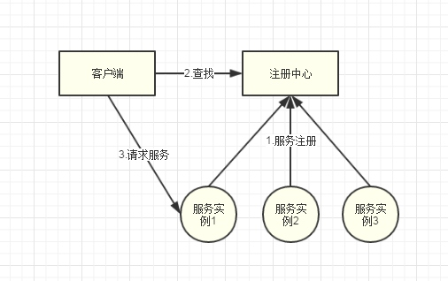
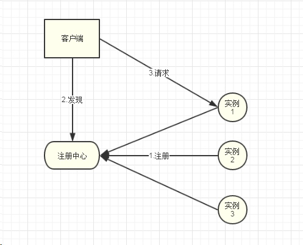
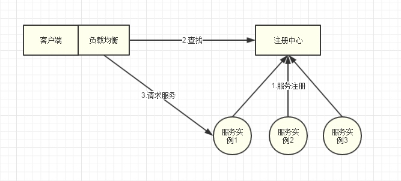
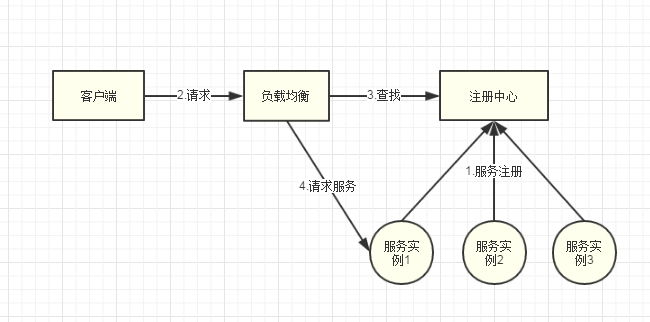
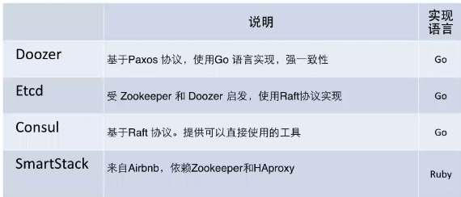

## 1 服务注册和服务发现
服务注册和发现的问题，其实是所有的分布式系统都面临的问题，而不是在微服务架构中所特有的。
- - - - -
### 1.1 为什么需要服务注册和服务发现
- 微服务其实根据业务划分之后的一个细粒度的分布式系统架构，经常是部署在如AWS之类云环境中，会涉及到大量实例重启，IP更换等情况？
- 另外针对应用，可能会出现业务有大量增加的情况，就需要对应的伸缩机制实现**auto scalling**，此时涉及到系统的水平伸缩，后台服务数量发生变化，如何将请求转发到伸缩后节点上？
- 针对PAAS平台等依赖于容器的环境，会有一个节点包含多个实例绑定不同端口的情况，如何去感知各个服务端口的变化？
以上是微服务架构中可能会出现的一些常见情况，服务注册和发现将有效解决这些问题
- - - - -
### 1.2 服务注册和发现的核心思想
个人感觉类似于**web-service**的思想，都会一个**registry**的概念；基本框架如下图

流程如下:
1. 各个服务的实例在启动之后，向服务注册中心注册
2. 客户端通过接口向注册中心查询可用服务实例列表
3. 客户端通过列表调用服务实例(可以自己访问或者通过负载均衡)
- - - - -
#### 1.2.1 服务注册与发现的方式
由于服务的提供方通常会有多个实例，则针对调用方去调用服务时，就会用多种方式，如上节第3点中提到的，具体可以分为:
- **客户端服务发现模式** 
客户端模式又分为两种情况，主要是和具体服务实例之间通信的差别:
1. 客户端模式第一种情况是指调用方通过注册中心直接去取到所有的服务实例信息，然后自己去判断选择调用那个具体的服务实例，如下图

2. 客户端模式第二种情况则是利用**客户端负载均衡**实现对服务实例的选择，如下图

利用客户端负载均衡，在客户端部署一个负载均衡，在部署模式该负载均衡是和客户端部署在一起的，通过轮循等机制达到提升服务可用性的效果；通常这种方式是在客户端的代码中集成负载均衡的SDK实现
- **服务端服务发现模式** 
服务端模式，重点强调的是负载均衡是一个独立的组件，独立部署，尤其是针对云环境，如AWS提供的ELB(Elastic Load Balancer)服务；客户端不直接和注册中心交互，而是**只感知到负载均衡对外暴露的接口**，客户端请求不会到达注册中心，而是通过负载均衡，然后调用服务实例

### 1.3 常用的服务注册与发现方案
- DNS
在服务化过程中，最原始的方案即为通过DNS(Domain Name Server)去实现服务发现；通过域名的方式将服务和一组IP绑定，调用方通过访问DNS域名解析得到服务的一个真实地址
DNS的优势在于配置方式比较简单，可以实现最简单的静态服务注册的配置；而针对前面提到的微服务架构及云环境中的情况，当有大量动态更新时，会对一致性有着很强的要求，DNS针对这种场景就比较无力
- Dubbo/DubboX
Dubbo是有阿里开源的分布式服务框架，其主要实现了服务注册与发现，服务间调用等功能；
其中服务注册与发现采用的是zookeeper实现，服务间调用为一套自研的RPC框架，对restful风格的支持不太完善；停止更新后，由当当在其基础上继续演进为DubboX，主要是提高其对restful的支持度；在微服务的配置中心，断路器等组件上功能缺失
- zookeeper
zookeeper是一个分布式的应用管理框架，最开始的是作为hadoop的组件之一出现，其主要功能是帮助hadoop集群中维护各个组件的一致性，比较强调于CAP原则中CP，更加强调于分布式集群中各个节点的数据一致性，在比较极端情况下，zookeeper中可能会出现由于为优先保证各节点数据一致性，而忽略其服务可用性的情况，导致调用方暂时无法访问到服务，需要使用者去考虑才有**fast fail**之类的策略以保障服务可用性
zookeeper工作原理是共享配置状态，在每个集群中**选举出领袖**，客户端可以连接到任何一台服务器获取数据
- Eureka
我司PAAS采用的组件之一？，由netflixOSS开源，spring集成到spring cloud框架中；eureka的设计更加强调的AP原则，更多去保证服务发现的可用性，并不能保证服务信息的有效性；另外，eureka同时实现了前面提到的客户端负载均衡的功能，通过ribbon组件帮助客户端在获取到了服务实例信息之后，调用实例
- consul
服务化集中配置工具之一，作为一个K-V键值对，也可以做服务注册与发现
- etcd
我司PAAS组件之一，K-V键值对存储

- - - - -
### 1.4 spring cloud Eureka实现服务注册与发现
#### 1.4.1 eureka的主要组件
#### 1.4.2 eureka的工作原理

#### 1.4.3 服务注册与发现代码实现
### 1.5 Eureka源码剖析

- - - - -
### 1.6 遗留问题
SOA/web-service/EBS
zookeeper工作原理
Dubbo简单实例
yaml语法示例
eureka的组件和具体实现过程
eureka作为注册中心可能出现的问题？
- - - - -
### 1.7 参考
- - - - -
