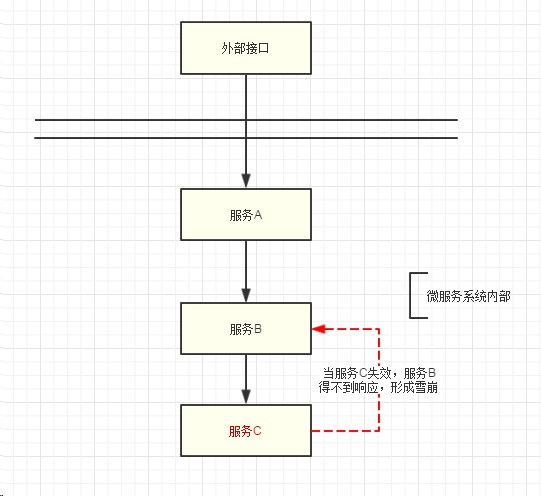
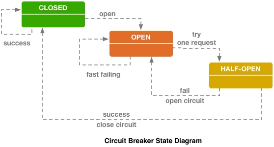

## 3 熔断器机制
针对分布式系统常常出现的一种情况是由于某个服务不可用导致整个系统不可用，微服务作为一个分布式系统架构，一样也面临这种问题。
- - - - -
### 3.1 雪崩效应(故障蔓延)
由于微服务架构，按照独立部署的原则，通常都是以独立的进程存在，如果需要和其他服务进行通信，一般通过请求对应的注册服务器以**服务注册与发现**的方式进行；这种模式当服务提供者出现异常或者网络异常时，会导致服务调用方一直得不到响应，根据一般的线程池模型(*之后分析下httpclient与okhttp的线程池代码*)实现会导致调用方阻塞，线程被阻塞，资源得不到释放，从而导致上级调用方出现异常，形成故障蔓延(Cascade Failure)，又称为雪崩效应，下图是一个简单示例。



服务雪崩效应是一种因**服务提供者**的不可用导致**服务调用者**的不可用,并将不可用逐渐放大 的过程.
- - - - -
### 3.2 雪崩效应形成原因
简化服务调用链，单纯只考虑服务的调用双方，在**服务调用方**，**服务提供方**，**通信机制**这3块都有可能会出现异常，雪崩效应可能发生在各个节点，各个阶段；可能有以下原因
- 硬件故障: 硬件故障可能为硬件损坏造成的服务器主机宕机, 网络硬件故障造成的服务提供者的不可访问
- 缓存击穿: 缓存击穿一般发生在缓存应用重启, 所有缓存被清空时,以及短时间内大量缓存失效时. 大量的缓存不命中, 使请求直击后端,造成服务提供者超负荷运行,引起服务不可用. (*在使用缓存的时候注意考虑这点*)
- 用户请求激增: 在秒杀和大促开始前,如果准备不充分,用户发起大量请求也会造成服务提供者的不可用.
- 重试机制: 在服务提供者不可用后, 用户由于忍受不了界面上长时间的等待,而不断刷新页面甚至提交表单；以及一般在服务调用端会存在大量服务异常后的重试逻辑；这些情况都会导致重试流量加大
- 程序bug
以上这些点都会导致服务崩溃，当服务调用者使用**同步调用**时, 会产生大量的等待线程占用系统资源. 一旦线程资源被耗尽,服务调用者提供的服务也将处于不可用状态, 于是服务雪崩效应产生了
- - - - -
### 3.3 雪崩效应的处理方法
针对雪崩效应，一般针对以下几个点进行处理
- 流量控制
```
流量控制 的具体措施包括:
    - 网关限流: 目前很多项目就通过nginx+lua在入口，对流量进行限制，结合之前分析的nginx rate limit等以及开源OpenResty方案 
    - 用户交互限流: 限制用户在重试时的频率，考虑在前端的点击按钮对用户进行限制
    - 关闭重试: 取消调用方的重试机制？
```
- 改进缓存模式
```
通过缓存预加载，尽量采用异步方式进行缓存刷新，减少缓存击穿的可能
```
- 自动扩容机制
```
通过监控机制，指定对应的指标，当服务达到阈值时，对服务进行动态扩容；典型的如AWS的autoScalling机制，利用cloud watch监控当前实例的各项指标
```
- 服务调用者降级服务
```
服务降级指的是在服务出现状况时，就算对外体现是服务质量下降，也要保证生产环境任然能够运行；只要能够工作，就是万幸。(区分服务降级和服务断路的区别)
服务降级可以考虑3点，首先，对服务调用方的资源进行隔离，使用不同的线程去调用不同的服务，避免大家共用同一资源，从而当某个服务崩溃时，不会影响其他服务；
其次，我们根据具体业务,将依赖服务分为: 强依赖和若依赖. 强依赖服务不可用会导致当前业务中止,而弱依赖服务的不可用不会导致当前业务的中止；
最后，针对不同的服务，可以用不同的降级措施。
```
常见的降级措施包括了限时(fast fail)、短路、预留退路(fallback)
```
限时
针对服务超时，可以通过超时控制保证接口的返回，可以通过设置超时时间为1s，尽快返回结果，因为大多数情况下，接口超时一方面影响用户体验，一方面可能是由于后端依赖出现了问题，如负载过高，机器故障等。互联网实践中通常采用，当系统故障时，fail fast。

电路熔断
这里的电路熔断是对于后端服务的保护，当错误、超时、负载上升到一定的高度，那么负载再高下去，对后端来说肯定是无法承受，好像和电路熔断一样，这三个因素超过了阈值，客户端就可以停止对后端服务的调用，这个保护的措施，帮助了运维人员能迅速通过增加机器和优化系统，帮助系统度过难关。

fallback
有些情况下，即使服务出错，对用户而言，也希望是透明的，无感的，设置一些fallback，做一些服务降级，保证用户的体验，即使这个服务实际上是挂掉的，返回内容是空的或者是旧的，在此故障期间，程序员能赶紧修复，对用户几乎没有造成不良体验。
```
#### 3.3.1 断路器原理
服务的健康状况 = 请求失败数 / 请求总数. 熔断器开关由关闭到打开的状态转换是通过当前服务健康状况和设定阈值比较决定的.

当熔断器开关关闭时, 请求被允许通过熔断器. 如果当前健康状况高于设定阈值, 开关继续保持关闭. 如果当前健康状况低于设定阈值, 开关则切换为打开状态.
当熔断器开关打开时, 请求被禁止通过.
当熔断器开关处于打开状态, 经过一段时间后, 熔断器会自动进入半开状态, 这时熔断器只允许一个请求通过. 当该请求调用成功时, 熔断器恢复到关闭状态. 若该请求失败, 熔断器继续保持打开状态, 接下来的请求被禁止通过.



- - - - -
### 3.4 netflix hystrix使用
Netflix Hystrix 是一个帮助解决分布式系统交互时超时处理和容错的类库, 它同样拥有保护系统的能力.
#### 3.4.1 hystrix的设计原则
Hystrix的设计原则包括:

资源隔离
熔断器
命令模式
- - - - -
### 3.5 hystrix源码剖析
- - - - -
### 3.6 遗留问题
- - - - -
### 3.7 参考
[Spring Cloud构建微服务架构（三）断路器](http://blog.didispace.com/springcloud3/)
[防雪崩利器：熔断器 Hystrix 的原理与使用](https://segmentfault.com/a/1190000005988895)
[Hystrix 使用与分析](http://hot66hot.iteye.com/blog/2155036)
[](http://)
- - - - -