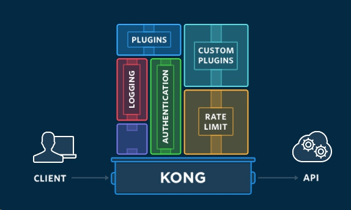

## 4 微服务网关
### 4.1 微服务网关设计思路
#### 4.1.1 为什么需要微服务网关
下面这张图是一个比较典型的例子，展示了在服务拆分之后，Amazon移动端商品展示页面可能需要涉及的后台服务；根据这张图我们可以思考下服务拆分之后暴露的几个问题

- 客户端调用多个不同服务
针对单体应用的而言，前台请求的响应，一般是通过单一的endpoint处理请求，在该endpoint中可能会汇总各个数据库表中的数据，然后根据请求统一返回到前台；但是在之前的微服务架构中，当根据业务边界对服务进行拆分之后，一个前台的请求可能涉及到多个不同服务的调用，这样针对前台而言，可能需要去访问多个不同的endpoint，然后在将后台返回的消息汇总
- 后端服务重构困难
对于微服务架构的另一特点而言是能够做到持续交付，但是在后端endpoint和前端强耦合的情况下，后端的改动可能没有办法及时体现，尤其是针对移动端app这种，例如apple store对应用的审核周期长达一个礼拜，相对而言你的后台服务可能一周都没有办法体现更新
- 服务间通信的成本高
针对后台服务，对于由于技术栈多种多样，或者由于性能的关系，不一定都会采用rest之类的风格，而是会采用rpc、amqp之类的其他通信方式，这样会导致前台可能没有办法很好的调用后台接口
- 认证鉴权等业务无关的功能耦合
权限控制是问题，在单体应用中一般都是通过session机制的实现，通过缓存用户的登录信息，能够去校验用户信息，但是在微服务框架中，各个服务之间是无状态的，通过之前的做法，可能会破坏服务的无状态性；
另外对于拆分后的服务而言，如果在每个服务都增加一个认证鉴权之类的接口，会造成大量的冗余代码，使得认证鉴权和各个业务耦合在一起，在之前的AAA服务中就很明显，任何一个endpoint都需要自己完成一次filter的注册，当认证鉴权服务改动，可能造成业务同样需要配合改动
- - - - --
#### 4.1.2 微服务网关思路
为解决上面提到的这些问题服务网关是一个比较好的解决办法，服务网关，在微服务架构中是一个系统唯一对外暴露的接口，是和外界交付的入口，如下图；通过服务网关可以在系统的入口处做许多事情，首先可以将内部的API封装，通过网关做请求转发及协议转化，避免前后台耦合，此外可以将一部分公共业务拆分至网关上，如认证鉴权，访问日志记录，负载均衡，静态请求处理，流量控制等

微服务网关的整体思路类似于门面模式(Facade)，能够最大程度隐藏后台的实现细节，避免了前后台的耦合，前台只需要和服务网关进行交互。

#### 4.1.3 微服务网关的带来的优势
优势:
- 客户端和服务端的解耦
- 向客户端提供合适的接口，减少不必要的交互
- 公共功能的拆分，使得业务代码能够更加聚焦于业务本身
劣势:
- 不太服务微服务去中心化的原则，服务网关很容易会成为一个瓶颈
- 需要单独实现维护网关服务，有一定的复杂性，尤其是可用性
- - - - -
### 4.2 常见微服务网关方案
- kong
基于nginx的一个开源解决方案，能够做到基本的请求转发(反向代理)，日志记录，认证鉴权，**限流**，以及定制化插件等功能，开源社区比较火爆



- node js
- zuul
- - - - -
### 4.3 spring cloud zuul的使用
Spring Cloud Netflix中的Zuul就担任了这样的一个角色，为微服务架构提供了前门保护的作用，同时将权限控制这些较重的非业务逻辑内容迁移到服务路由层面，使得服务集群主体能够具备更高的可复用性和可测试性。java编写，采用filter的机制实现，功能比较单一，关于认证鉴权，log等机制都需要自己实现
- - - - -
#### 4.3.1 zuul配置使用
第一步，设置相关依赖
```grovy
dependencies {
     compile("org.springframework.boot:spring-boot-starter-web")     
     compile("org.springframework.boot:spring-boot-starter-actuator")
     compile('org.springframework.cloud:spring-cloud-starter-zuul') // 引入zuul的依赖
     compile('org.springframework.cloud:spring-cloud-starter-eureka') //引入eureka client，向eureka server注册服务
     testCompile('org.springframework.boot:spring-boot-starter-test')
}

dependencyManagement {
     imports {
          mavenBom "org.springframework.cloud:spring-cloud-dependencies:${springCloudVersion}"
     }
}
```
第二步，通过设置`@EnableZuulProxy`注解，在springboot application中开启zuul
```java

@SpringBootApplication
@EnableZuulProxy
@EnableDiscoveryClient
public class ZuulApplication {
    public static void main(String[] args) {
        new SpringApplicationBuilder(ZuulApplication.class).web(true).run(args);
   }

    @Bean
    public AccessLogFilter accessLogFilter() {
        return new AccessLogFilter();
    }

}
```
第三步，配置zuul的路由规则，zuul提供了`根据url`和`根据服务id`两种映射方式
- 通过url的方式，需要在配置文件中指定所有服务的具体url，才能完成配置，将对应的请求的path和服务对应的url进行匹配
- 通过service的方式，需要对eureka的支持，当存在eureka server时，可以直接通过指定服务的id，然后zuul可以通过eureka serve获取到服务的具体地址，完成path和地址的匹配
```
server:
  port: 8040
zuul:
  ignoredServices: "*"
  prefix: /api   #表示在所有的请求前都加上/api这个前缀
  routes:
    review-service:
      path: /review-service/**
      serviceId: REVIEW
      #http://localhost:8040/api/review-service/reviews?eventId=1
    review-by-url:
      path: /reviews-url/**
      url: http://localhost:8085/
      #http://192.168.10.143:8040/api/reviews-url/reviews?eventId=1
 ----
spring:
  profiles: standalone
zuul:
  ignoredServices: "*"
  prefix: /api
  routes:
    event: /events
    review: /reviews
```
第四步，自行扩展zuul提供的filter，实现其他功能
zuul提供了一个ZuulFilter的抽象类，可以自行扩展这个接口，主要包含下面4个方法
`filterType`：返回一个字符串代表过滤器的类型，在zuul中定义了四种不同生命周期的过滤器类型，具体如下：
```
pre：可以在请求被路由之前调用
routing：在路由请求时候被调用
post：在routing和error过滤器之后被调用
error：处理请求时发生错误时被调用
```
`filterOrder`：通过int值来定义过滤器的执行顺序
`shouldFilter`：返回一个boolean类型来判断该过滤器是否要执行，所以通过此函数可实现过滤器的开关。在上例中，我们直接返回true，所以该过滤器总是生效。
`run`：过滤器的具体逻辑。需要注意，这里我们通过ctx.setSendZuulResponse(false)令zuul过滤该请求，不对其进行路由，然后通过ctx.setResponseStatusCode(401)设置了其返回的错误码，当然我们也可以进一步优化我们的返回，比如，通过ctx.setResponseBody(body)对返回body内容进行编辑等。
- - - - --
### 4.4 遗留问题
问题1: 前后端分离的概念
问题2: node js相关内容入门
问题3: 尽量不要利用微服务网关去组装微服务，所有关于业务本身的功能，最好是在服务本身实现
问题4: 在服务网关的实现过程中，多考虑容错机制，如引入hystrix，避免网关成为为服务框架的瓶颈，造成单点故障
- - - - -
### 4.5 参考
[Spring Cloud构建微服务架构（五）服务网关](http://blog.didispace.com/springcloud5/)
[使用API网关构建微服务](http://www.infoq.com/cn/articles/construct-micro-service-using-api-gateway/)
[微服务架构为何需要搭配API网关？](http://developer.51cto.com/art/201611/522521.htm)
[我所知道的那点微服务](https://sanwen8.cn/p/706hCKQ.html)