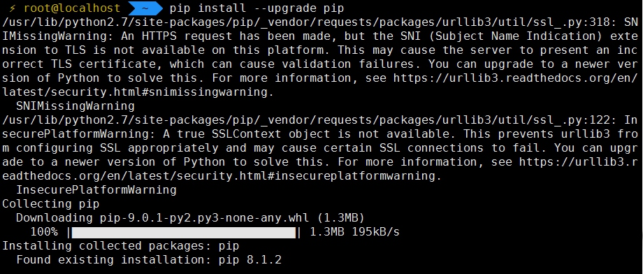

### 环境搭建
#### pip安装
在使用centos7时，通过yum安装python-pip时，默认时没有pip安装包，提示如下错误信息
```
yum install python-pip.noarch
Loaded plugins: fastestmirror, langpacks
base                                                                | 3.6 kB  00:00:00     
extras                                                              | 3.4 kB  00:00:00     
updates                                                             | 3.4 kB  00:00:00     
Loading mirror speeds from cached hostfile
 * base: mirror.keystealth.org
 * extras: pubmirrors.dal.corespace.com
 * updates: repos.lax.quadranet.com
No package python-pip.noarch available.
Error: Nothing to do
```


该错误说明没有对应的软件包；这是由于类似于centos之类的linux衍生发行版，源的内容会比较滞后，或者缺少一些扩展源，这时可以通过增加[EPEL](http://fedoraproject.org/wiki/EPEL)拓展源解决，EPEL是由 Fedora 社区打造，为 RHEL 及衍生发行版如 CentOS、Scientific Linux 等提供高质量软件包的项目。
所以具体安装步骤为:
- 安装EPEL扩展源
```
yum -y install epel-release
```


- 安装python-pip
```
yum install python-pip
```


- 更新pip
```
pip install --upgrade pip
```



- 清楚yum缓存
```
yum clean all
```


#### docker-compose安装
- 通过pip安装docker-compose
```
pip install docker-compose
```


- 解决安装中的坑。。。
- 验证结果
```
docker-compose --version
```

- - - - --
#####安装问题
**问题１:**docker-compose运行时，可能会出现如下报错
```
pkg_resources.DistributionNotFound: backports.ssl-match-hostname>=3.5
```
**解决方法:**问题是由如下截图原因导致，docker-compose要求的backports版本3.5以上，可以通过升级backports版本解决

```
pip install -U backports.ssl_match_hostname
```
验证后升级后版本
```
pip freeze |grep backports
```


- - - - -
**问题2:** docker-compose运行期间出现urlprase错误，错误截图如下
```
docker-compose --version
Traceback (most recent call last):
  File "/usr/bin/docker-compose", line 7, in <module>
    from compose.cli.main import main
  File "/usr/lib/python2.7/site-packages/compose/cli/main.py", line 17, in <module>
    from . import errors
  File "/usr/lib/python2.7/site-packages/compose/cli/errors.py", line 11, in <module>
    from docker.errors import APIError
  File "/usr/lib/python2.7/site-packages/docker/__init__.py", line 2, in <module>
    from .api import APIClient
  File "/usr/lib/python2.7/site-packages/docker/api/__init__.py", line 2, in <module>
    from .client import APIClient
  File "/usr/lib/python2.7/site-packages/docker/api/client.py", line 9, in <module>
    import websocket
  File "/usr/lib/python2.7/site-packages/websocket/__init__.py", line 23, in <module>
    from ._app import WebSocketApp
  File "/usr/lib/python2.7/site-packages/websocket/_app.py", line 35, in <module>
    from ._core import WebSocket, getdefaulttimeout
  File "/usr/lib/python2.7/site-packages/websocket/_core.py", line 33, in <module>
    from ._handshake import *
  File "/usr/lib/python2.7/site-packages/websocket/_handshake.py", line 29, in <module>
    from ._http import *
  File "/usr/lib/python2.7/site-packages/websocket/_http.py", line 33, in <module>
    from ._url import *
  File "/usr/lib/python2.7/site-packages/websocket/_url.py", line 27, in <module>
    from six.moves.urllib.parse import urlparse
ImportError: No module named urllib.parse

```


**解决方法:**具体问题没有定位清楚，通过google找到解决方案，更新websocket库
```
pip install -U websocket
```


验证结果，运行正常


**参考**
[ImportError: No module named urllib.parse](https://github.com/docker/compose/issues/1288)